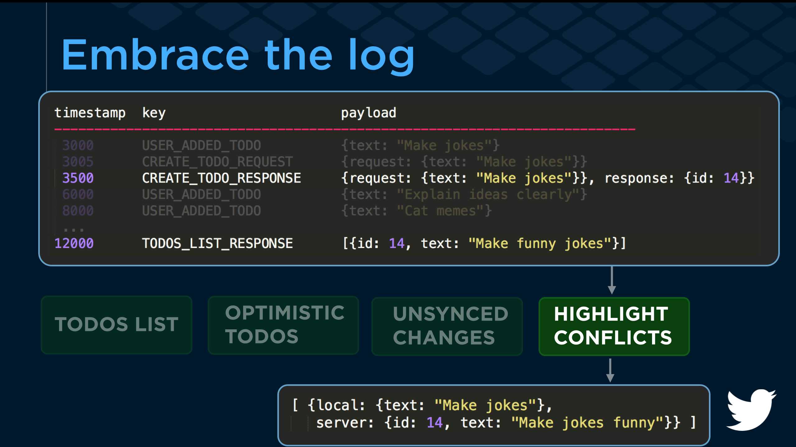
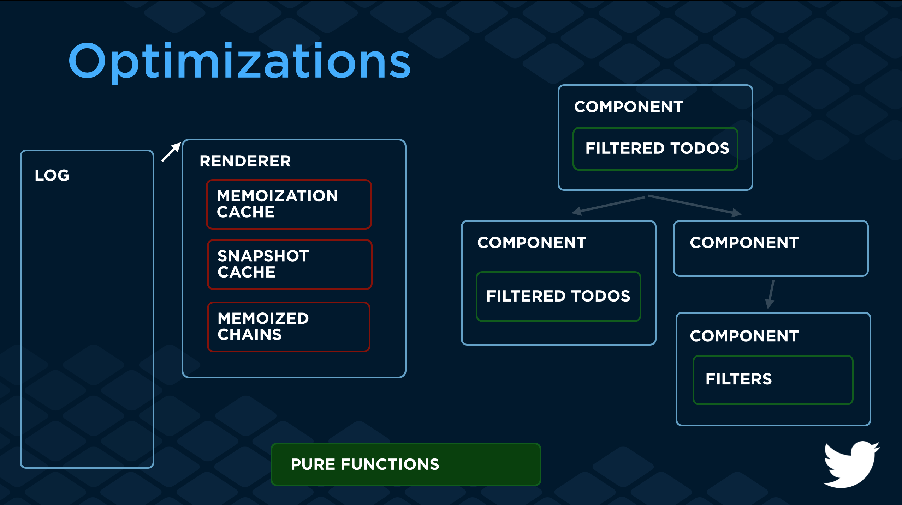

This is a side project.

# loggit
Embracing the log for UI engineering!

As data flows through, it's appended to an immutable log.  React components describe what computations they want run on that log in a `computations` method.  They can then ask the library to perform those computations directly in the render method.

Preserving more information enables features like undo, optimistic updates or surfacing conflicting edits by simply swapping in different computations over the log.

This slideshow walks through [why this is powerful in more detail](docs/embrace_the_log_why.pdf).

[](docs/embrace_the_log_why.pdf)

[Full talk](https://www.youtube.com/watch?v=EOz4D_714R8&index=3&list=PLCC436JpVnK3HvUSAHpt-LRJkIK8pQG6R) and [full slides](docs/full_slides.pdf) from React Europe.

# How it works
The library provides a `loggit` object to components as the API, which includes:
 - `recordFact`: takes a fact about something that happened, an `Action` since this is using Redux as a starting point
 - `computeFor`: the way components ask for computation to be performed.  They need to pass a reference to themselves (the React component), and need to implement a `computations` method that returns a map of `Computation` objects.

Reducers are the only computations used at this point.  `Computation` objects are like plain reducer functions, but they explicitly have the shape `{initial,reducer}`, rather than having the initial value hidden inside the reducer.  This is so that even if there are no facts, the return value of the `Computation` still has the same shape, and is not undefined.

This slideshow with notes walks through whiteboarding the overall idea of [how this could be implemented](docs/embrace_the_log_whiteboarding_how.pdf).

[](docs/embrace_the_log_whiteboarding_how.pdf)


# Optimizations
### Renderers
There are a few different renderers, which are notified when facts are appended to the log, and can respond in some way to update the view.  These are:
- `NaiveReactRenderer`: after each fact, it calls `React.render` and does a top-down render.
- `RafReactRenderere`: runs a requestAnimationFrame loop, which will batch up multiple facts between frames

### Compute optimizers
There are also a few optimizers, that can optimize the computation instead of just reducing over the whole log each time.  These are:
  - `NoopOptimizer`: does nothing, it just does reduce over the log each time
  - `MemoizingOptimizer`: memoizes some computations (with not very sensible semantics around 
bounding the cache)
  - `MemoizingOptimizerV2`: same thing, just trying to be simpler about how the internals work and simpler about bounding the size of the cache
  - `MemoizingSnapshotOptimizer`: memoizes calls but also caches snapshots of reductions over the log, to start from when performing subsequent reduce operations.  Cache here isn't bounded at the moment.


### PrecomputeReactRenderer
And finally, there's a `PrecomputeReactRenderer`, which is slightly more involved and experimental.  It uses a seam in the loggit API to React components that lets it track which components need which computations.  It can then use this information to be more efficient about updating the UI than just doing a top-down render.  This involves reaching into React internals describing the component tree, but essentially walks the tree, checking if the computations that the component needs have changed, and if they haven't, then we don't need to perform the render/reconciliation step for that component.  We do still need to check its children though, since data doesn't flow top-down anymore (it's as if it were side-loaded).  This is similar to the discussion in https://github.com/facebook/react/issues/3398#issuecomment-118532289, although the implementation here is simple and naive.

### Compaction
I wrote an initial key-based compaction strategy, just as a proof of concept for reclaiming memory space.  More information is in this issue: https://github.com/kevinrobinson/loggit/issues/2

# Profiling
There are data and notes from initial profiling in this issue: https://github.com/kevinrobinson/loggit/issues/1


# Starting points to read code
- Using loggit from a component: [writing](https://github.com/kevinrobinson/loggit/blob/master/loggit-todomvc/components/MainSection.js#L37) and  [reading](https://github.com/kevinrobinson/loggit/blob/master/loggit-todomvc/components/MainSection.js#L56)
- Stiching the outer pieces of the system together to create the `loggit` API for components: [shell.js](https://github.com/kevinrobinson/loggit/blob/master/loggit-todomvc/loggit/shell.js#L19)
- An [optimizer](https://github.com/kevinrobinson/loggit/blob/master/loggit-todomvc/loggit/optimizers/memoizing_snapshot_optimizer.js)

### Demo app

There's a demo app in `loggit-todomvc`, to run it:
```
cd loggit-todomvc
npm install
npm start
open http://localhost:3001
```

It's the standard TodoMVC app (adopted from @gaearon's awesome https://github.com/gaearon/redux one).  There's some random fixture data loaded to start, and there's a "Monkey" button that will start driving the UI with random data as part of a performance test case.  

# Next
This is just a side project, so with that caveat, here are some thoughts on next steps.

The real next work here is in API design for computations.  I think this example shows well that reducers aren't an intuitive fit for modeling these kinds of computations (how `CHECK_TODO` works is a good example).  I think a good thing to try here can also provide some efficiency gains, and that's supporting chained computation in the same style as nuclear-js.  So in addition to `reducers` there could also be a `merge` computation, that has the shape `{inputs: {foo: computation, bar: computation}, merge}`, where the semantics are that each computation in the `inputs` set needs to be computed first, and then the `merge` fn will be run with `{foo: value, bar: value}`.  It can perform any arbitrary computation with those and return it.  This would work well for this todos app, where when we're collecting Todos it'd be simpler to store as a map, and we could map that to a sorted list after.  Or keep an index of sort order separately, or which todos are checked separately, and merge them into a higher-level entity.

Also, this doesn't really demonstrate the real value of this approach when it comes to server communication, since there's no server. :)  So that would be a good improvement to add that in here, and then add computations to perform the kinds of things I mentioned in the talk.

Swap in immutable data structures.

I'd love to hear any feedback folks have.  This is early work but I think it demonstrates some of the ideas fairly well and can serve as a useful communication point if other people find it interesting or useful.
